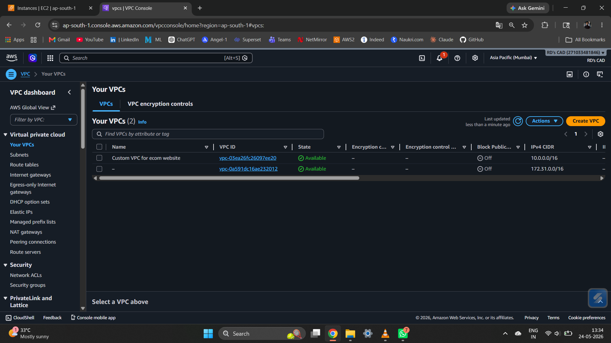
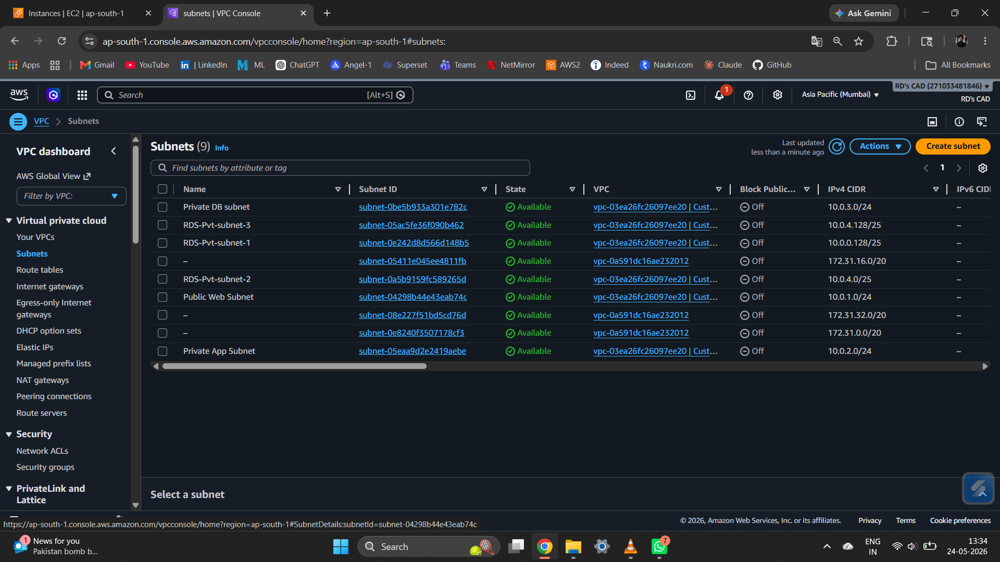
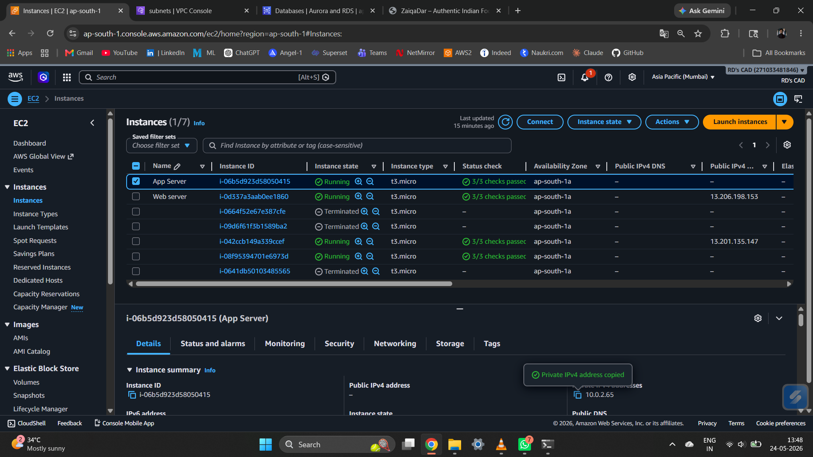
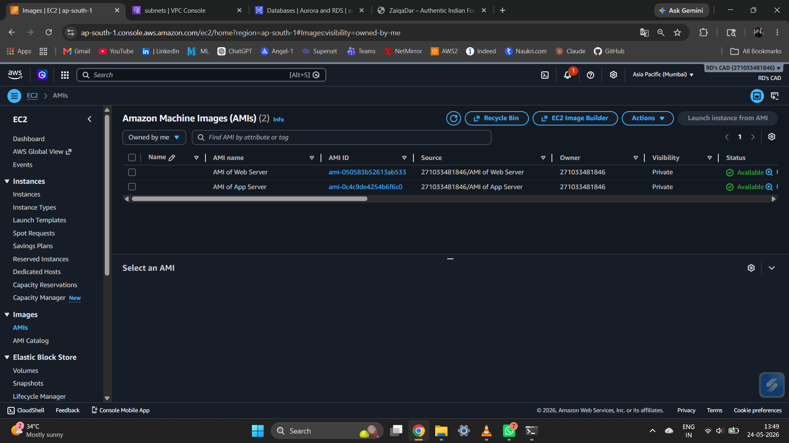
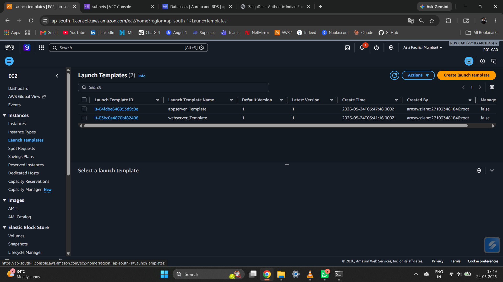
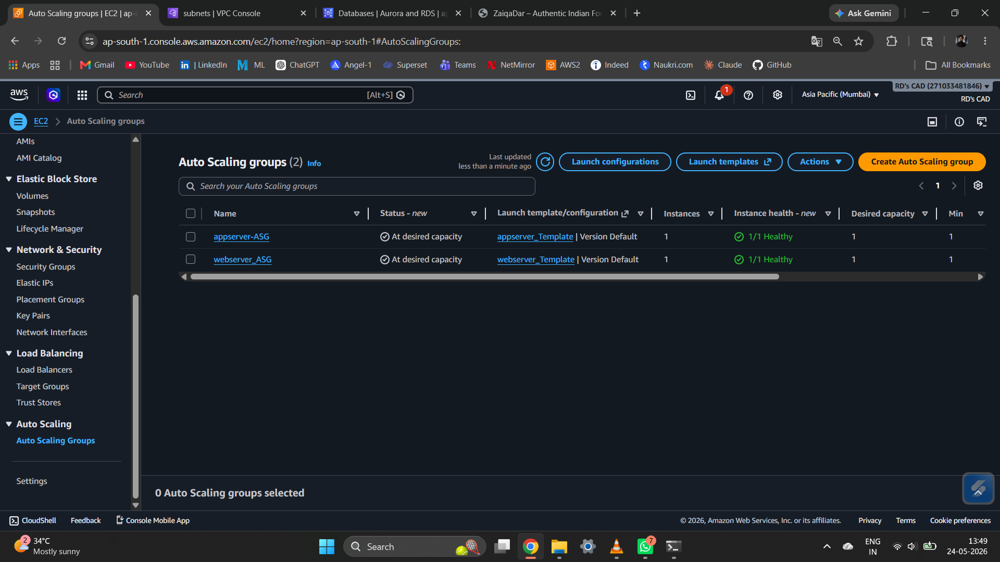
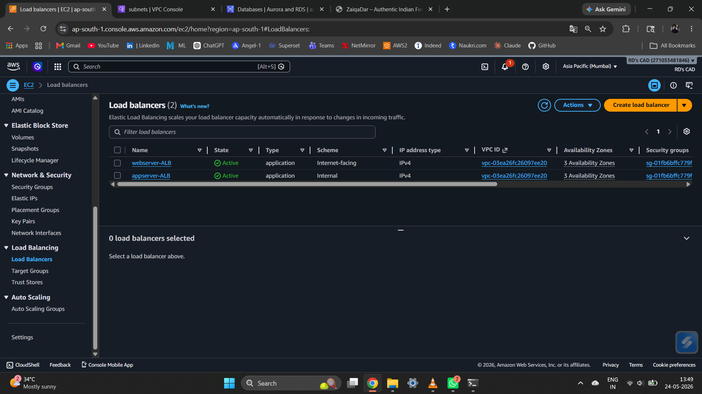
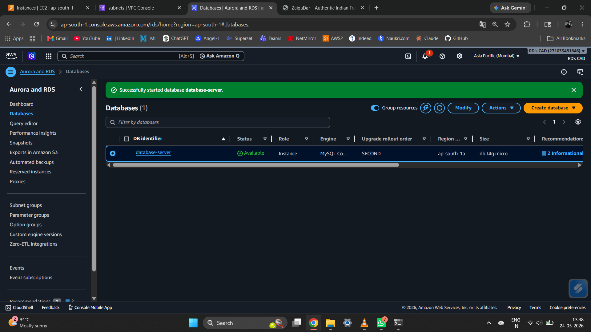
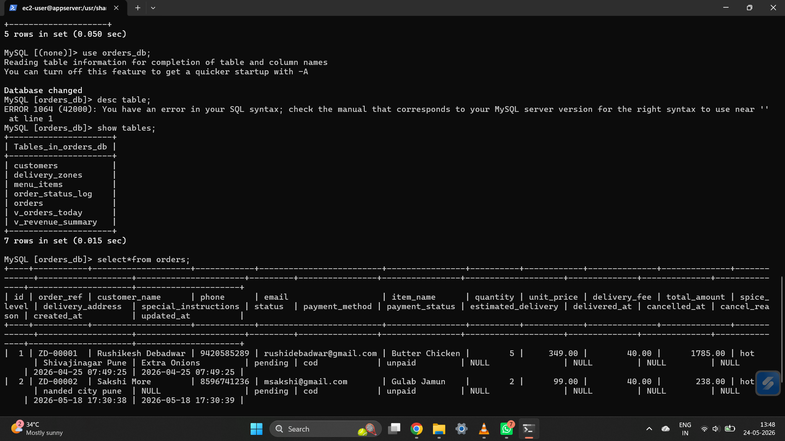
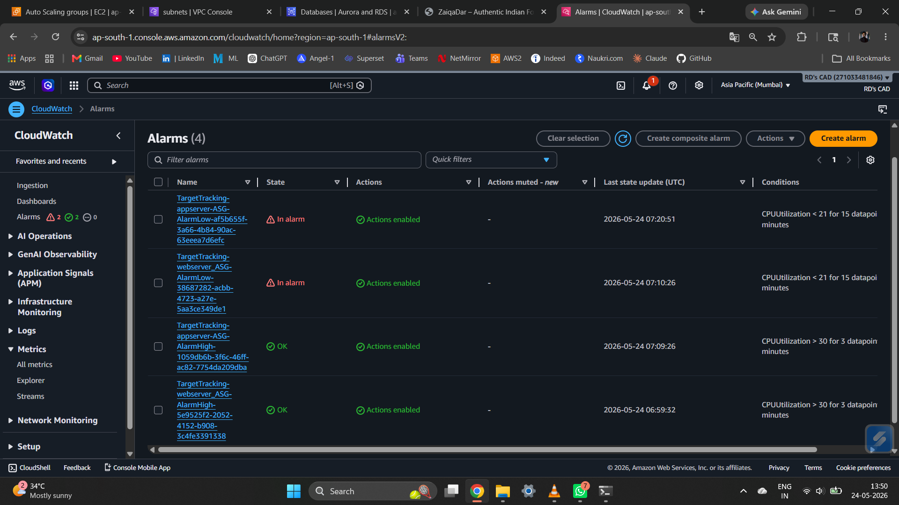

# ZaiqaDar - Authentic Indian Food Delivery Application

## AWS 3-Tier Architecture with Auto Scaling and High Availability

---

## Project Overview

ZaiqaDar is a full-stack Indian food delivery web application deployed on AWS using a secure, scalable 3-tier architecture. The project demonstrates end-to-end cloud infrastructure design, application development, and production-ready deployment practices including auto scaling, load balancing, and real-time monitoring.

The application is built on a LEMP stack (Linux, Nginx, MySQL, PHP) and structured across three distinct tiers: a web tier serving the frontend, an application tier handling backend business logic, and a database tier managed via Amazon RDS.

---

## Architecture Overview

```
Internet
    |
[External ALB - Internet-facing]
    |
[Web Tier - Public Subnet]
  Nginx (HTML/CSS Frontend)
    |
[Internal ALB - Private]
    |
[Application Tier - Private Subnet]
  PHP-FPM Backend (confirm.php)
    |
[Database Tier - Private Subnet]
  Amazon RDS (MySQL)
```

---

## Technology Stack

**Cloud Infrastructure**
- Amazon EC2 (t3.micro instances)
- Amazon RDS (MySQL Community, db.t4g.micro)
- Amazon VPC with custom subnets
- Application Load Balancers (ALB)
- Auto Scaling Groups (ASG)
- Amazon CloudWatch
- Amazon SNS

**Application Stack**
- Linux (Ubuntu) - Operating System
- Nginx - Web Server
- MySQL - Relational Database
- PHP-FPM - Backend Application Layer
- HTML / CSS - Frontend

---

## AWS Infrastructure Components

### VPC and Networking

A custom VPC (`10.0.0.0/16`) was created with separate public and private subnets across availability zones to isolate each tier of the architecture.



**Subnets configured:**
- Public Web Subnet (`10.0.1.0/24`) - hosts the web tier and external ALB
- Private App Subnet (`10.0.2.0/24`) - hosts the application tier
- Private DB Subnet (`10.0.3.0/24`) - hosts the RDS instance
- RDS Private Subnets (`10.0.4.0/25`, `10.0.4.128/25`, `10.0.0.128/25`) - for multi-AZ RDS subnet group



**Security Group Chaining:**
- Web SG allows inbound HTTP/HTTPS traffic from the internet via the external ALB
- App SG accepts traffic only from the Web Security Group
- RDS SG allows inbound MySQL (port 3306) only from the App Security Group

---

### EC2 Instances

The project uses separate EC2 instances for the web tier and application tier, both running as t3.micro instances in the ap-south-1 (Mumbai) region.



---

### Amazon Machine Images (AMI)

Custom AMIs were created from the configured web server and application server instances. These AMIs are used as the base for the Auto Scaling launch templates, ensuring new instances are pre-configured with all required software and application files.



---

### Launch Templates

Two launch templates were created from the custom AMIs:

- `webserver_Template` - used by the web server Auto Scaling Group
- `appserver_Template` - used by the application server Auto Scaling Group



---

### Auto Scaling Groups

Auto Scaling Groups (ASGs) were configured for both tiers to maintain availability and automatically scale based on load.

- `webserver_ASG` - manages web server instances
- `appserver_ASG` - manages application server instances

Both ASGs maintain a desired capacity of 1 instance with a minimum of 1, and scale up or down based on CPU utilization metrics tracked by CloudWatch.



---

### Application Load Balancers (ALB)

Two ALBs were configured to manage traffic routing:

- `webserver-ALB` - Internet-facing ALB that receives public traffic and distributes it to web tier instances across 3 availability zones
- `appserver-ALB` - Internal ALB that routes traffic from the web tier to the application tier securely within the VPC



---

### Amazon RDS

The database layer uses Amazon RDS with MySQL Community engine deployed as a `db.t4g.micro` instance in the `ap-south-1a` availability zone. The database identifier is `database-server` and is accessible only from within the application tier subnet.



**Database Schema (`orders_db`):**

Tables:
- `customers`
- `menu_items`
- `orders`
- `delivery_zones`
- `order_status_log`
- `v_orders_today` (view)
- `v_revenue_summary` (view)



---

### CloudWatch Monitoring

Amazon CloudWatch was configured with 4 alarms for both ASGs:

- `TargetTracking-appserver-ASG-AlarmHigh` - triggers scale-out when CPU > 30% for 3 data points
- `TargetTracking-webserver-ASG-AlarmHigh` - triggers scale-out when CPU > 30% for 3 data points
- `TargetTracking-appserver-ASG-AlarmLow` - triggers scale-in when CPU < 21% for 15 data points
- `TargetTracking-webserver-ASG-AlarmLow` - triggers scale-in when CPU < 21% for 15 data points



---

### Amazon SNS Notifications

Amazon SNS was integrated with the Auto Scaling Groups to send real-time email notifications for scaling events such as instance launches and terminations.

The email below shows an actual SNS notification received when the `webserver_ASG` terminated an instance in response to the CloudWatch low-CPU alarm firing and reducing the desired capacity from 2 to 1.


---

## Application

### Frontend

The frontend is a single-page HTML/CSS application served by Nginx on the web tier. It uses the Poppins and Playfair Display fonts with a custom color palette inspired by Indian cuisine (saffron, turmeric, crimson).

**CSS Variables:**
```css
--saffron:  #FF6B00
--turmeric: #FFC107
--crimson:  #C0392B
--cream:    #FFF8F0
--charcoal: #1A1A2E
```


---

### Website - Home Page


---

### Website - Food Category Page

The menu page allows filtering by category: All, Veg, Non-Veg, Biryani, and Desserts.


---

### Website - Order Page

The order form collects customer name, phone number, email, selected dish, quantity, spice level, delivery address, and special instructions.


---

### Backend - confirm.php

The PHP backend script (`confirm.php`) runs on the application tier (Tier 2) and handles order confirmation. It connects to the RDS MySQL database on Tier 3 via PDO.

Key features:
- Strict type enforcement (`declare(strict_types=1)`)
- CORS headers configured for API access
- Only accepts HTTP POST requests (returns 405 for others)
- Input sanitization using `mb_substr` + `strip_tags`
- Environment variable-based database credentials with fallback defaults
- Validates required fields before processing


---

## Key Achievements

- Successfully deployed a production-like 3-tier architecture on AWS
- Implemented secure network isolation using custom VPC, subnets, and security group chaining
- Configured auto scaling with CloudWatch metric-based alarms for both tiers
- Set up dual ALBs (external + internal) for secure traffic routing
- Integrated SNS for real-time infrastructure event notifications
- Built a complete LEMP stack application with a PHP backend connecting to RDS over PDO
- Created reusable AMIs and launch templates for reproducible instance provisioning

---

## Skills Demonstrated

- AWS Cloud: VPC, EC2, ALB, ASG, RDS, IAM, SNS, CloudWatch
- Networking: Subnets, Route Tables, Internet Gateway, Security Groups
- Load Balancing: Application Load Balancer, Target Groups
- Scalability: Auto Scaling Groups with Launch Templates and custom AMIs
- Monitoring: Amazon CloudWatch alarms and metrics
- Linux Administration: SSH, Nano, Nginx, PHP-FPM configuration
- Frontend: HTML, CSS
- Backend: PHP (PDO, input validation, CORS handling)
- Database: MySQL (Amazon RDS, schema design, views)

---

## Project Date

May 2026 | Region: ap-south-1 (Mumbai)
